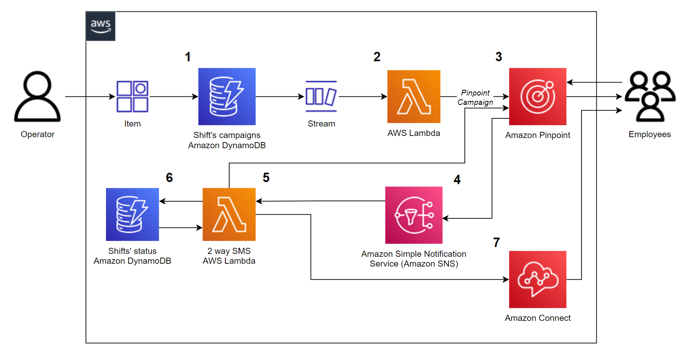
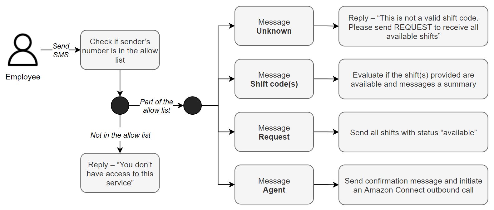
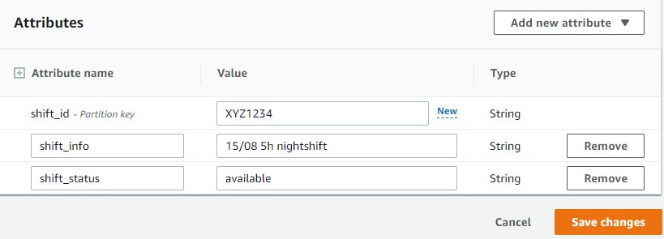
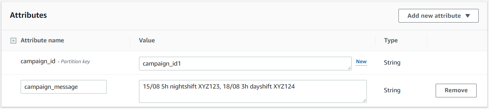

## Shift management using Amazon Pinpoint's 2-way-SMS

The solution presented in this repository is part of the blog [Shift management using Amazon Pinpoint's 2-way-SMS]().

Note that the solution can be used for shift management but with small changes it can also communicate available appointments to customers / patients.

The solution uses Amazon Pinpoint two way SMS, Amazon DynamoDB, AWS Lambda, Amazon Simple Notification Service and Amazon Connect (optional). The next section dives deeper into the architecture diagram and logic flow.

 

1. The operator adds an item to the **Shift’s campaigns Amazon DynamoDB** table. The item consists of a **unique key** that is used as the **Amazon Pinpoint Campaign Id** and a **Campaign Message**, which is used as the **SMS message text** that the campaign recipients will receive. The **Campaign Message** needs to include all available shifts that the operator wants to notify the employees about.
    1. **Note:** This can be done either from the AWS console or programmatically via API.
2. Amazon DynamoDB streams invokes an AWS Lambda function upon creation of a new Amazon DynamoDB item. The AWS Lambda function uses the Amazon DynamoDB data to create and execute an Amazon Pinpoint SMS Campaign based on an existing customer segment of employees who are interested in overtime shifts. The customer segment is a prerequisite and it includes the SMS endpoints of the employees who are interested in receiving shift updates.
3. Employees who belong in that segment receive an SMS with the available shifts and they can reply to book the ones they are interested in.
4. Any inbound SMS is published on an Amazon SNS topic.
5. The **2 way SMS** AWS Lambda function subscribes to the Amazon Simple Notification Service and processes all inbound SMS based on their message body.
6. The **Shift’s status** Amazon DynamoDB table stores the status of the shifts, which gets updated depending on the inbound SMS.
7. If the employee requires further assistance, they can trigger an Amazon Connect outbound call via SMS.

The diagram below illustrates the four possible messages an employee can send to the application. To safeguard the application from outsiders and bad actors, the **2 way SMS** AWS Lambda function looks up if the senders mobile number is in an allow list. In this solution, the allow list is hardcoded as an AWS Lambda environment variable but it can be stored in a data base like Amazon DynamoDB.

 

### Solution implementation

#### Prerequisites

To deploy this solution, you must have the following:

* An [originating identity](https://docs.aws.amazon.com/pinpoint/latest/userguide/channels-sms-originating-identities.html) that supports 2 way SMS in the country you are planning to send SMS to - [Supported countries and regions (SMS channel)](https://docs.aws.amazon.com/pinpoint/latest/userguide/channels-sms-countries.html).
* A mobile phone to send and receive SMS.
* An [AWS account](https://aws.amazon.com/premiumsupport/knowledge-center/create-and-activate-aws-account/).
* An Amazon Pinpoint project - [How to create an Amazon Pinpoint project](https://catalog.workshops.aws/amazon-pinpoint-customer-experience/en-US/prerequisites/create-a-project) .
* An SMS customer segment - Download the [example CSV](https://github.com/aws-samples/pinpoint-shift-management-2-way-sms/blob/main/assets/Pinpoint_Imported_SMS_Segment.csv), that contains one SMS endpoint. Replace the phone number (column C) with yours and import it to Amazon Pinpoint - [How to import an Amazon Pinpoint segment](https://docs.aws.amazon.com/pinpoint/latest/userguide/segments-importing.html).
* Add your mobile number in the Amazon Pinpoint SMS sandbox - [Amazon Pinpoint SMS sandbox](https://docs.aws.amazon.com/pinpoint/latest/userguide/channels-sms-sandbox.html).
* An Amazon Connect instance, number & contact flow if you want your employees to be able to request an agent call back. Download the [example Connect contact flow](https://github.com/aws-samples/pinpoint-shift-management-2-way-sms/blob/main/assets/Connect-ContactFlow-Example) that you can import to your [Amazon Connect instance](https://docs.aws.amazon.com/connect/latest/adminguide/contact-flow-import-export.html).

**Note:** Performing outbound calls for UK numbers with a **+44** prefix is not allowed by default. To enable this, submit a service quota increase request. For more information, see [Amazon Connect Service Quotas](https://docs.aws.amazon.com/connect/latest/adminguide/amazon-connect-service-limits.html) in the Amazon Connect Administrator Guide.

#### Deploy the solution

1. Download the [**CloudFormation template**](https://github.com/aws-samples/pinpoint-shift-management-2-way-sms) and navigate to the AWS CloudFormation console in the AWS region you want to deploy the solution.
2. Select **Create stack** and *With new resources*. Choose **Template is ready** as **Prerequisite - Prepare template** and **Upload a template file** as **Specify template**. Upload the template downloaded in **step 1**.
3. Fill the AWS CloudFormation parameters as shown below:
    1. **ApprovedNumbers:** The mobile numbers that are allowed to use this service. The format should be E164 and if there is more than one number separate them by comma e.g. +4457434243,+432434324.
    2. **OriginationNumber:** The mobile number that you have in your Amazon Pinpoint account in E164 format e.g. +44384238975.
    3. **PinpointProjectId:** The existing Amazon Pinpoint project Id.
    4. **SegmentId:** The Amazon Pinpoint existing segment Id that you want to send the SMS notifications to.
    5. **ConnectEnable:** Select **YES** if you already have an Amazon Connect instance with a Contact Flow and Queue. If you select **NO** ignore all the fields below, the solution will still be deployed but employees won't be able to request a call back.
    6. **InstanceId:** The Amazon Connect InstanceId. Follow this [link](https://docs.aws.amazon.com/connect/latest/adminguide/find-instance-arn.html) to learn how to find your Amazon Connect InstanceId.
    7. **ContactFlowID:** The Amazon Connect Contact Flow Id that you want this solution to use. Follow this [link](https://docs.aws.amazon.com/connect/latest/adminguide/find-contact-flow-id.html) to learn how to find your Amazon Connect ContactFlow id.
    8. **QueueID:** The Amazon Connect Queue Id. To obtain the **Amazon Connect Queue Id** navigate to your **Amazon Connect instance > Routing > Queues** and it should appear on the browser URL, see example: https://your-instance.awsapps.com/connect/queues/edit?id=**0c7fed63-815b-4040-8dbc-255800fca6d7**.
    9. **SourcePhoneNumber:** The Amazon Connect number in E164 format that is connected to the Contact Flow provided in **step 7**.
4. Once the solution has been successfully deployed, navigate to the Amazon DynamoDB console and access the **ShiftsStatusDynamoDB** table. Each item created represents a shift and should have a unique **shift_id** that employees use to book the shifts, a column **shift_status** with value = **available** and a column **shift_info** where you can put additional information about the shift - see example below.

**DynamoDB item JSON example:**
``` JSON
{
  "shift_id": {
    "S": "XYZ1234"
  },
  "shift_info": {
    "S": "15/08 5h nightshift"
  },
  "shift_status": {
    "S": "available"
  }
}
```


7. Navigate to **Amazon Pinpoint console > SMS and voice > Phone numbers**, select the phone number that you used as **OriginationNumber** for this solution and enable **Two-way SMS**. Under the **Incoming messages destination** section, select **Choose an existing SNS topic** and select the one containing the name **TwoWaySMSSNSTopic**.
8. Navigate to the Amazon DynamoDB console and access the **ShiftsCampaignDynamoDB** table. Each item you create represents an Amazon Pinpoint SMS campaign. Create an item and provide a unique **campaign_id**, which will be used as the Amazon Pinpoint Campaign name. Create a new attribute (string) with the name **campaign_message** and type all available shifts that you want to communicate via this campaign. It is important to contain the **shift id** for each of them so employees can request them - see example below. 
    1. **Note:** By completing this step, you will trigger an Amazon Pinpoint SMS Campaign. You access the campaign information and analytics from the Amazon Pinpoint console.

**DynamoDB item JSON example:**
``` JSON
{
  "campaign_id": {
    "S": "campaign_id1"
  },
  "campaign_message": {
    "S": "15/08 5h nightshift XYZ123, 18/08 3h dayshift XYZ124"
  }
}
```



### Testing the solution

1. Make sure you have created the shifts in the Amazon DynamoDB **ShiftsStatusDynamoDB** table.
2. To test the SMS Campaign, replicate Step 7 under **Deploy the solution**.
3. Reply to the SMS received with the options below:
    1. Send a **shift_id** that doesn't exist to receive an automatic response "This is not a valid shift code, please reply by typing REQUEST to view the available shifts".
    2. Send a valid & available **shift_id** to book the shift and then check the **ShiftsStatusDynamoDB** Amazon DynamoDB table, where the **shift_status** should change to *taken* and there should be a new column *employee* with the mobile number of the employee who has requested it.
    3. Send **REQUEST** to receive all shifts with **shift_status = available**.
    4. If you have deployed the solution along with Amazon Connect, send **AGENT** and await for the call.

### Clean-up

To delete the solution, navigate to the AWS CloudFormation console and delete the stack deployed.
